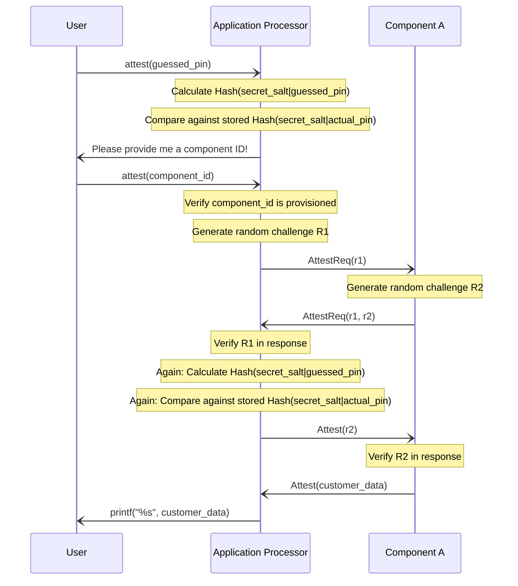
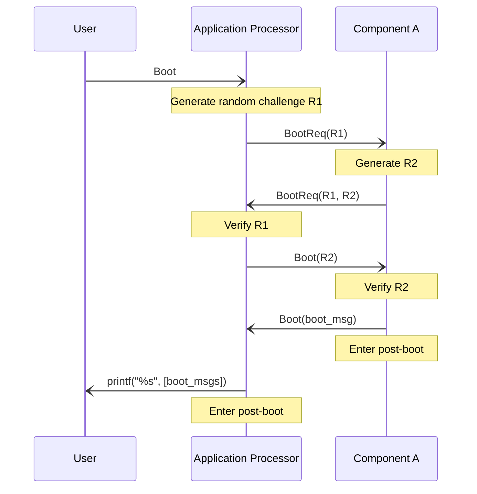
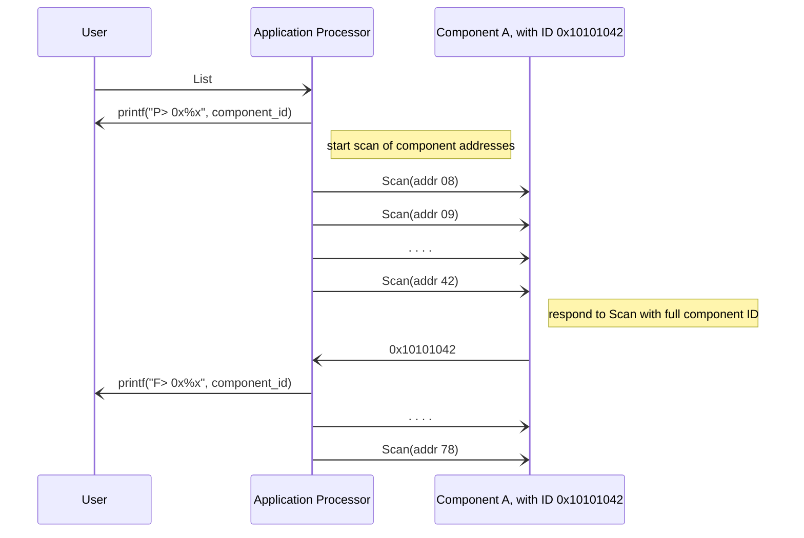
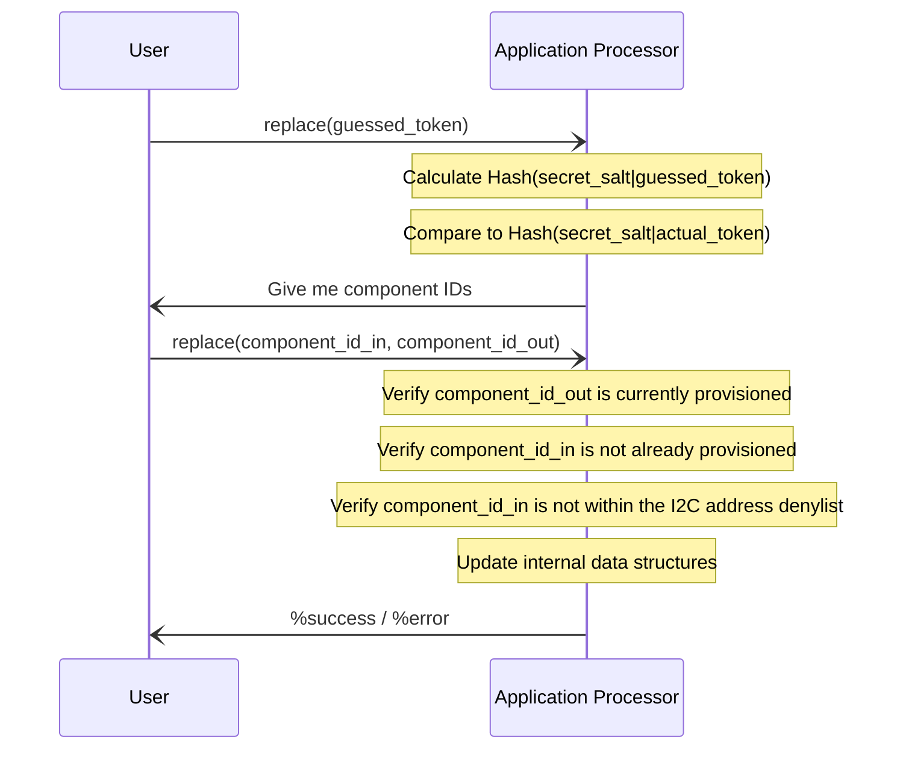

# MIT eCTF 2024

This repository holds the MIT TechSec's design for the eCTF MISC system in [MITRE's 2024 eCTF](https://ectfmitre.gitlab.io/ectf-website/)

## Design

See `design_document.pdf` for a rendered PDF of the below design details.

## Summary

Our defenses consist of three main components:

1. Messaging scheme with authenticated encryption and associated data
2. Challenge-response for verifying liveliness of AP and Components
3. Redundant checks & random delays along critical paths to frustrate glitching attacks

The messaging scheme is explained in more detail at the end of the document, but the key aspects that provide us with integrity, authenticity, and protecting us from replay attacks are:
- All devices in a deployment use a shared secret key for ChaCha20-Poly1305
- Randomly generated nonces per-boot are also used as sequence numbers
- Messages with unexpected nonces/sequence numbers are rejected

Validity and integrity of devices is measured by their ability to communicate within the authenticated messaging scheme, and by their ability to answer random challenges.

## Security requirements

Here we briefly justify our adherence to the various security requirements.
### SR 1
> The Application Processor (AP) should only boot if all expected Components are present and valid.

The AP requires that all provisioned Components correctly respond to a random challenge before commanding Components to boot, and subsequently booting itself.

### SR 2
> Components should only boot after being commanded to by a valid AP that has confirmed the integrity of the device.

Components require that an AP correctly responds to a random challenge before it will follow commands to boot.

### SR 3
> The Attestation PIN and Replacement Token should be kept confidential.

The Attestation PIN and Replacement Token are never stored in plaintext on the AP firmware. Each are salted and hashed at compile-time. Guesses from the user are hashed with the corresponding salt, and compared with the expected result using constant-time comparison functions. This eliminates any timing attacks, and greatly reduces the utility of any power-analysis attacks of the memory comparison operations.

### SR 4
> Component Attestation Data should be kept confidential. Attestation Data should only be returned by the AP for a valid Component if the user is able to provide the correct Attestation PIN.

Redundant checks for a correct Attestation PIN are made on the AP before commanding the component to provide its Attestation Data. Additionally, Components require the AP answers a random challenge before providing its Attestation Data.

### SR 5
> The integrity and authenticity of messages sent and received using the post-boot MISC communications functionality should be ensured.

Our use of ChaCha20-Poly1305 provides for integrity and authenticity of messages. By generating random initial nonces at boot, and using incrementing nonces as sequence numbers for our messages, we prevent replay attacks, even across reboots!

## Messaging scheme

See `common/include/common_msg.h` for relevant data structures.

### Packet structure
All messages, except for the `LIST` command, are sent within packets.

Each packet has three fields:
- **Authenticated Data** (19 bytes)
- **Authentication** Tag (16 bytes)
- **Ciphertext** (up to 220 bytes)

The **Authenticated Data** field has five sub-fields:
- `opcode` (1 byte): Designates command type and content of ciphertext field
- `nonce` (12 bytes): The nonce used in making this packet
- `component_id` (4 bytes): The component the packet is either to or from
- `length` (1 byte): The length of the ciphertext field
- `for_ap` (1 byte): Boolean designating if sent to AP or sent to Component

The **Authentication Tag** is generated as part of the ChaCha20-Poly1305 encryption function, and is used to verify the integrity of authenticity of both the **Authenticated Data** field and the **Ciphertext** field.

The **Ciphertext** field is encrypted message content that varies depending on the messages opcode. For an `Attest` command, it may be encrypted Attestation Data, while for a `BootReq` command, it may contain an encrypted challenge.

Devices first verify that a received packet has **Authenticated Data** fields it expects, then verifies the entire packet against the **Authentication Tag**, then decrypts the **Ciphertext** field and acts upon the received `opcode`.

### Opcodes
There are 6 valid opcodes:
1. `Init`: Initiates a new session with a device. Used once per power-cycle per component.
2. `AttestReq`: Prelude to `Attest`, carries challenges between AP and component.
3. `Attest`: Carries an AP's response to a challenge, or Attestation Data.
4. `BootReq`: Prelude to `Boot`, carries challenges between AP and Component.
5. `Boot`: Carries an AP's response to a challenge, or a Boot Message.
6. `PostBoot`: Designates a message is part of the Post-Boot scheme.

### Session initialization

See `application_processor/src/ap_session.c` for relevant code.

A "session" refers to the set of an `outgoing_nonce` and an `incoming_nonce` an AP associates with each provisioned Component. Before any authenticated message can be sent to a Component (i.e., any opcode besides `Init`), the AP must initialize a session. This is not explicitly commanded by any user and is handled automatically.

The AP will generate a random `outgoing_nonce` and include this nonce in its `Init` packet to a Component. Upon receiving this packet, the Component will save the included nonce as its `incoming_nonce`, and return its own randomly generated `outgoing_nonce` in its response `Init` packet. The AP verifies that, in its received response `Init` packet, the Component has included the nonce the AP originally sent. If so, the `AP` saves the incoming nonce from the Component.

Authenticated packets sent to a Component are ignored when a session has not been initialized. Additionally, packets are ignored when the packet's nonce does not match the stored expected incoming nonce.

Outgoing nonces are incremented after every successful packet construction (i.e., after a successful call to `make_mit_packet`), and incoming nonces are incremented after every valid packet is received from a give component (see end of `issue_cmd`).

## User commands

Here we detail the messaging sequence for each of the Attest, Boot, List, and Replace commands.
#### On Challenges

Note that our "challenges" are simply generating a random sequence of bytes, and verifying that that same random sequence is included in the next returned message. If we receive a valid (i.e. authenticated) message from a device with the same sequence included, it means that we just talked to a live & active device as part of our current per-power-cycle session.

These challenges ensure that a replayed sequence of packets to or from a device, perhaps in an attempt to fake the presence of a component that is not actually connected, won't succeed, as they will include a different response to the live device's challenge.

### Attest

The attest command is for Users to fetch Customer Data from Components.

This scheme puts all trust on the AP to validate the guessed_pin.




### Boot

This command instructs the AP to enter the post-boot phase.

The example below is shown only for the case of an AP provisioned with one component. For an AP with multiple components, the AP would challenge all components with `BootReq`s before it proceeds to send any `Boot` commands.

This scheme puts all trust on the AP to correctly determine all components are connected before sending `Boot` commands.




### List

This is an unauthenticated command, in order to reduce the complexity of our session management.

Scan packets from the AP are 4-bytes long, with the last byte being the I2C address.

If a component receives a 4-byte message, then it will respond with its component ID (which is 4-bytes) and not attempt any sort of decryption, authentication, or increase a nonce.



### Replace

This command lets a user swap out a provisioned component for another component.



## External libraries used

We use [wolfSSL](https://github.com/wolfSSL/wolfssl) for generating our runtime SHA256 hashes, for encryption & decryption in ChaCha20-Poly1305, and for constant-time memory comparisons.

We use [sha256_literal](https://github.com/aguinet/sha256_literal) for generating SHA256 hashes of our Attestation Pin and Replacement Token at compile-time.

---

## Code Layout

- `application_processor` - Code for the application processor
    - `project.mk` - This file defines project specific variables included in the Makefile
    - `Makefile` - This makefile is invoked by the eCTF tools when creating a application processor
    - `inc` - Directory with c header files
    - `src` - Directory with c source files
    - `wolfssl` - Location to place wolfssl library for included Crypto Example
- `common` - Code common to the AP and Component, e.g. common crypto functions & packet structures
- `deployment` - Code for deployment secret generation
    - `Makefile` - This makefile is invoked by the eCTF tools when creating a deployment
    - You may put other scripts here to invoke from the Makefile
- `ectf_tools` - Host tools and build tools - DO NOT MODIFY ANYTHING IN THIS DIRECTORY
    - `attestation_tool.py` - Runs attestation command on application processor
    - `boot_tool.py` - Boots the application processor and sensors
    - `list_tool.py` - Lists what sensors are currently online
    - `replace_tool.py` - Replaces a sensor id on the application processor
    - `build tools` - Tools to build
- `component` - Code for the components
    - `project.mk` - This file defines project specific variables included in the Makefile
    - `Makefile` - This makefile is invoked by the eCTF tools when creating a component
    - `inc` - Directory with c header files
    - `src` - Directory with c source files
    - `wolfssl` - Location to place wolfssl library for included Crypto Example
- `shell.nix` - Nix configuration file for Nix environment
- `custom_nix_pkgs` - Custom derived nix packages
    - `analog-openocd.nix` - Custom nix package to build Analog Devices fork of OpenOCD


## Usage and Requirements

This repository contains two main elements: firmware source code and tooling.

Firmware is built through the included eCTF Tools. These tools invoke the Makefiles
in specific ways in the provided Nix environment. Firmware compiling should be executed 
through these included tools.

Source code and tooling is provided that runs directly on the host. All of these tools are 
created in Python. The tools can be easily installed with the use of Poetry. Once inside 
of the activated Nix environment, run `poetry install` to initialize the Poetry environment. 
These tools can be invoked either through `poetry run {toolname}` or by activating the poetry environment
with `poetry shell` and then running as standard python programs.

### Environment Build

The environment is built with a Nix, which should install all packages
necessary for running the design in a reproducible fashion. The environment is automatically 
built when an eCTF Build Tool is run. If building `analog_openocd.nix` this step may 
take some time to complete.

Development can be prototyped by launching into the Nix environment through `nix-shell`.

### Host Tools

Host Tools for the 2024 competition do not need to be modified by teams at any point. Your design
should work with the standardized interface between host and MISC system. The host tools will 
pass any required arguments to the MISC system and receive all relevant output.

### Deployment

When creating a deployment, the Makefile within the `deployment` folder of the design 
repo will be executed. This is the only stage in which information can be shared between 
separate portions of the build (e.g. components and application processors). A clean 
target should be implemented in this Makefile to allow for elimination of all generated secrets.

### Application Processor and Component

When building the application processor and components, the `Makefile` with the 
respective directories will be invoked. The eCTF Tools will populate parameters into 
a C header file `ectf_params.h` within the design directory. Examples of these header 
files can be found in the respective main source files for the application processor 
and component.

## Using the eCTF Tools
### Building the deployment 
This will run the `Makefile` found in the deployment folder using the following inputs:

```
ectf_build_depl --help
usage: eCTF Build Deployment Tool [-h] -d DESIGN

Build a deployment using Nix

options:
  -h, --help            show this help message and exit
  -d DESIGN, --design DESIGN
                        Path to the root directory of the included design
```

**Example Utilization**
```bash
ectf_build_depl -d ../ectf-2024-example
```
### Building the Application Processor
This will run the `Makefile` found in the application processor folder using the following inputs:

```
ectf_build_ap --help
usage: eCTF Build Application Processor Tool [-h] -d DESIGN -on OUTPUT_NAME [-od OUTPUT_DIR] -p P
                                             -b BOOT_MESSAGE

Build an Application Processor using Nix

options:
  -h, --help            show this help message and exit
  -d DESIGN, --design DESIGN
                        Path to the root directory of the included design
  -on OUTPUT_NAME, --output-name OUTPUT_NAME
                        Output prefix of the built application processor binary Example 'ap' -> a
  -od OUTPUT_DIR, --output-dir OUTPUT_DIR
                        Output name of the directory to store the result: default: .
  -p PIN, --pin PIN     PIN for built application processor
  -t TOKEN, --token TOKEN
                        Token for built application processor
  -c COMPONENT_CNT, --component-cnt COMPONENT_CNT
                        Number of components to provision Application Processor for
  -ids COMPONENT_IDS, --component-ids COMPONENT_IDS
                        Component IDs to provision the Application Processor for
  -b BOOT_MESSAGE, --boot-message BOOT_MESSAGE
                        Application Processor boot message
```

**Example Utilization**
```bash
ectf_build_ap -d ../ectf-2024-example -on ap --p 123456 -c 2 -ids "0x11111124, 0x11111125" -b "Test boot message" -t 0123456789abcdef -od build
```

### Building the Component
```
ectf_build_comp --help
usage: eCTF Build Application Processor Tool [-h] -d DESIGN -on OUTPUT_NAME [-od OUTPUT_DIR] -id COMPONENT_ID -b BOOT_MESSAGE -al
                                             ATTESTATION_LOCATION -ad ATTESTATION_DATE -ac ATTESTATION_CUSTOMER

Build an Application Processor using Nix

options:
  -h, --help            show this help message and exit
  -d DESIGN, --design DESIGN
                        Path to the root directory of the included design
  -on OUTPUT_NAME, --output-name OUTPUT_NAME
                        Output prefix of the built application processor binary Example 'ap' -> ap.bin, ap.elf, ap.img
  -od OUTPUT_DIR, --output-dir OUTPUT_DIR
                        Output name of the directory to store the result: default: .
  -id COMPONENT_ID, --component-id COMPONENT_ID
                        Component ID for the provisioned component
  -b BOOT_MESSAGE, --boot-message BOOT_MESSAGE
                        Component boot message
  -al ATTESTATION_LOCATION, --attestation-location ATTESTATION_LOCATION
                        Attestation data location field
  -ad ATTESTATION_DATE, --attestation-date ATTESTATION_DATE
                        Attestation data date field
  -ac ATTESTATION_CUSTOMER, --attestation-customer ATTESTATION_CUSTOMER
                        Attestation data customer field
```

**Example Utilization**
```bash
ectf_build_comp -d ../ectf-2024-example -on comp -od build -id 0x11111125 -b "Component boot" -al "McLean" -ad "08/08/08" -ac "Fritz"
```

## Flashing
Flashing the MAX78000 is done through the eCTF Bootloader. You will need to initially flash the eCTF Bootloader onto the provided hardware. 
This can be done easily by dragging and dropping the [provided bootloader](https://ectfmitre.gitlab.io/ectf-website/2024/components/bootloader.html) (for design phase:`insecure.bin`) to the DAPLink interface. DAPLink will show up as an external drive when connected to your system. Succesfull installation would make a blue LED flash on the board.

To flash a specific bootloader image on the board (AP or Components), use `ectf_update`.
```
ectf_update [-h] --infile INFILE --port PORT

optional arguments:
  -h, --help       show this help message and exit
  --infile INFILE  Path to the input binary
  --port PORT      Serial port
```

**Example Utilization**
```bash
ectf_update --infile example_fw/build/firmware.img --port /dev/ttyUSB0
```

## Host Tools
### List Tool
The list tool applies the required list components functionality from the MISC system. This is availble on the 
PATH within the Poetry environment as `ectf_list`.

```
ectf_list -h
usage: eCTF List Host Tool [-h] -a APPLICATION_PROCESSOR

List the components connected to the medical device

options:
  -h, --help            show this help message and exit
  -a APPLICATION_PROCESSOR, --application-processor APPLICATION_PROCESSOR
                        Serial device of the AP
```

**Example Utilization**
``` bash
ectf_list -a /dev/ttyUSB0
```

### Boot Tool
The boot tool boots the full system. This is available on the PATH within the Poetry environment as `ectf_boot`

```
ectf_boot --help
usage: eCTF Boot Host Tool [-h] -a APPLICATION_PROCESSOR

Boot the medical device

options:
  -h, --help            show this help message and exit
  -a APPLICATION_PROCESSOR, --application-processor APPLICATION_PROCESSOR
                        Serial device of the AP
```

**Example Utilization**
``` bash
ectf_boot -a /dev/ttyUSB0
```

### Replace Tool
The replace tool replaces a provisioned component on the system with a new component.
This is available on the PATH within the Poetry environment as `ectf_replace`.

```
ectf_replace --help
usage: eCTF Replace Host Tool [-h] -a APPLICATION_PROCESSOR -t TOKEN -i COMPONENT_IN -o COMPONENT_OUT

Replace a component on the medical device

options:
  -h, --help            show this help message and exit
  -a APPLICATION_PROCESSOR, --application-processor APPLICATION_PROCESSOR
                        Serial device of the AP
  -t TOKEN, --token TOKEN
                        Replacement token for the AP
  -i COMPONENT_IN, --component-in COMPONENT_IN
                        Component ID of the new component
  -o COMPONENT_OUT, --component-out COMPONENT_OUT
                        Component ID of the component being replaced
```

**Example Utilization**
``` bash
ectf_replace -a /dev/ttyUSB0 -t 0123456789abcdef -i 0x11111126 -o 0x11111125
```

### Attestation Tool
The attestation tool returns the confidential attestation data provisioned on a component.
This is available on the PATH within the Poetry environment as `ectf_attestation`.

``` 
ectf_attestation --help
usage: eCTF Attestation Host Tool [-h] -a APPLICATION_PROCESSOR -p PIN -c COMPONENT

Return the attestation data from a component

options:
  -h, --help            show this help message and exit
  -a APPLICATION_PROCESSOR, --application-processor APPLICATION_PROCESSOR
                        Serial device of the AP
  -p PIN, --pin PIN     PIN for the AP
  -c COMPONENT, --component COMPONENT
                        Component ID of the target component
```

**Example Utilization**
```
ectf_attestation -a /dev/ttyUSB0 -p 123456 -c 0x11111124
```
